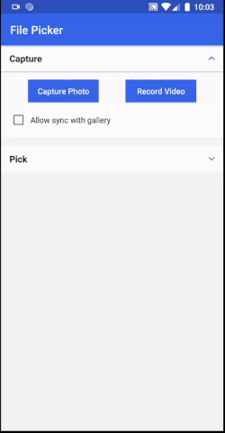
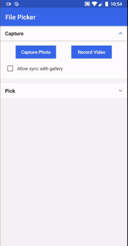

# **FilePicker**
[](https://developer.android.com/index.html)

[](http://www.apache.org/licenses/LICENSE-2.0)

FilePicker allows you to easily capture an image, record a video or pick any file from the document library.





# **Setup**

### To Import FilePicker to your project:
1. Open your project in Android Studio
2. Download the library (using Git, or a zip archive to unzip)
3. Go to File > Import-Module and import the library as a module
4. Right-click on the app in your project view and select "Open Module Settings"
5. Click the "Dependencies" tab and then the '+' button
6. Select "Module Dependency"
7. Select "FilePicker"

### Runtime permissions
This library requires specific runtime permissions. Declare it in your `AndroidMnifest.xml`:

For capturing an image or recording a video:
```xml
<uses-permission android:name="android.permission.WRITE_EXTERNAL_STORAGE" />
<uses-permission android:name="android.permission.CAMERA" />
```
For picking files from the document library:
```xml
<uses-permission android:name="android.permission.READ_EXTERNAL_STORAGE" />
```
**Note**: for devices running API 23 (Marshmallow) and up you have to request these permissions in the runtime, before calling `IPickFilesFactory.pickFiles()`. It's demonstrated in the sample app.

# **Usage**

Create IPickFileFactory instance:
```kotlin
private var pickFilesFactory: IPickFilesFactory? = null
```
### Capture photo

To capture images we need to get an instance of PickFilesFactory by passing FileTypes.IMAGE_CAMERA to getInstance() method.

```kotlin
pickFilesFactory = PickFilesFactory(
                caller = this,
                requestCode = 1001,
                galleryFolderName = "File Picker_Images",
                allowSyncWithGallery = true,
                thumbnailSize = Size(200, 200)
            ).getInstance(FileTypes.CAPTURE_IMAGE)
```
To start capturing images, call
```kotlin
pickFilesFactory?.pickFiles()
```

### Record video

To record video we need to get instance of PickFilesFactory by passing FileTypes.VIDEO_CAMERA to getInstance() method.
```kotlin
pickFilesFactory = PickFilesFactory(
                caller = this,
                requestCode = 1003,
                galleryFolderName = "File Picker_Videos",
                allowSyncWithGallery = true,
                thumbnailSize = Size(200, 200)
            ).getInstance(FileTypes.CAPTURE_VIDEO)
```
To start capturing videos, call
```kotlin
pickFilesFactory?.pickFiles()
```
### pick files from documents
To pick any type of file from a document, we need to get an instance of PickFilesFactory by passing FileTypes.PICK_FILES to getInstance() method.

```kotlin
pickFilesFactory = PickFilesFactory(
                caller = this,
                requestCode = 1004,
                selectionMode = SelectionMode.MULTIPLE,
                thumbnailSize = Size(200, 200)
            ).getInstance(fileTypes = FileTypes.PICK_FILES)
```
To open the document by Intent.ACTION_OPEN_DOCUMENT, need to call pickFilesFactory?.pickFiles() and pass the mime types to allow specific file types
```
pickFilesFactory?.pickFiles(mimeTypeList: ArrayList<MimeType> = arrayListOf(MimeType.ALL_FILES))
```
### PickFilesFactory attributes
**caller**
```
refers to host Fragment/Activity. Used to get context and startActivityForResult
```
**requestCode**
```
used to handle [Fragment.onActivityResult]/[android.app.Activity.onActivityResult]
```
**allowSyncWithGallery**
```
Set to true, if you would like the captured images and videos to be added to the Gallery.
```
**galleryFolderName**
```
Set it to a name if you would like the captured images and videos to be added to the Gallery inside a folder specific to your app. If not sent, the files will be saved in the default folder.
```
**selectionMode**
```
In case of picking files, you can set the selection mode to be single or multiple.
```
**thumbnailSize**
 ```
 refers to [Size] class. used for thumbnail custom size
 ```


### Getting selected files list
In your caller Activity/Fragment you need to call **pickFilesFactory?.handleActivityResult()** inside the Activity's or the fragment's onActivityResult callback to be able to get the list of selected files by passing an instance of the PickFilesStatusCallback interface .
```kotlin
fun onActivityResult(requestCode: Int, resultCode: Int, data: Intent?) {
        super.onActivityResult(requestCode, resultCode, data)
        pickFilesFactory?.handleActivityResult(requestCode, resultCode, data, object :
        PickFilesStatusCallback {
        override fun onPickFileCanceled() {
            // pick file process canceled by user (resultCode = RESULT_CANCELED)
        }

        override fun onPickFileError(errorModel: ErrorModel) {
            // some error occurred
        }

        override fun onFilePicked(fileData: ArrayList<FileData>) {
            // files picked successfully 
        }
    })
                
 }
```

### PickFilesStatusCallback
An interface to handle captured/picked file status as action canceled, some error occurred or files picked successfully.

**Methods**
```
fun onPickFileCanceled() : fired when action is canceled
fun onPickFileError(errorModel: ErrorModel) : fired when error occurred, containing error model usage documented in the sample.
fun onFilePicked(fileData: ArrayList<FileData>): fired when files picked successfully and return list of files
```
#### FileData.kt
```
Is a data class containing captured/picked file information
```
**uri:**
```
file saved uri.
```
**tempFilePath:**
```
file-path in the storage
```
**tempFile:**
```
captured/picked file
```

**fileName:**
```
captured/picked file name
```

**mimeType:**
```
captured/picked file mime type
```

**fileSize:**
```
captured/picked file size in bytes
```

**thumbnail:**
```
thumbnail bitmap for captured/selected image/video
```
## Enums
#### MimeType.kt
```
Is an enum class containing all possible mime types used when picking files from the document. usage documented in the sample app.  
```
#### FileTypes.kt
```
Is an enum class containing three types CAPTURE_IMAGE, CAPTURE_VIDEO, and PICK_FILES used to get an instance of IPickFilesFactory based on usage:
CAPTURE_IMAGE: passed when need to capture an image. 
CAPTURE_VIDEO: passed when need to record a video. 
PICK_FILES: passed when need to pick files from the document.
```
#### SelectionMode.kt
```
Is an enum class containing two types SINGLE, MULTIPLE used to detect if should allow multiple selections from the document:
SINGLE: will not allow multiple selections
MULTIPLE: will allow multiple selections
```
#### ErrorStatus.kt
```
An enum describing the type of error occurred.
DATA_ERROR: refers to some required data (file,mime type,..etc) is corrupted.
FILE_ERROR: refers to error occurred while capturing file and/or save the file
PICK_ERROR: refers to data retrieved is null or empty while picking files from document  
```
# **License**
    Copyright 2020-present Link Development

    Licensed under the Apache License, Version 2.0 (the "License");
    you may not use this file except in compliance with the License.
    You may obtain a copy of the License at

        http://www.apache.org/licenses/LICENSE-2.0

    Unless required by applicable law or agreed to in writing, software
    distributed under the License is distributed on an "AS IS" BASIS,
    WITHOUT WARRANTIES OR CONDITIONS OF ANY KIND, either express or implied.
    See the License for the specific language governing permissions and
    limitations under the License.
 